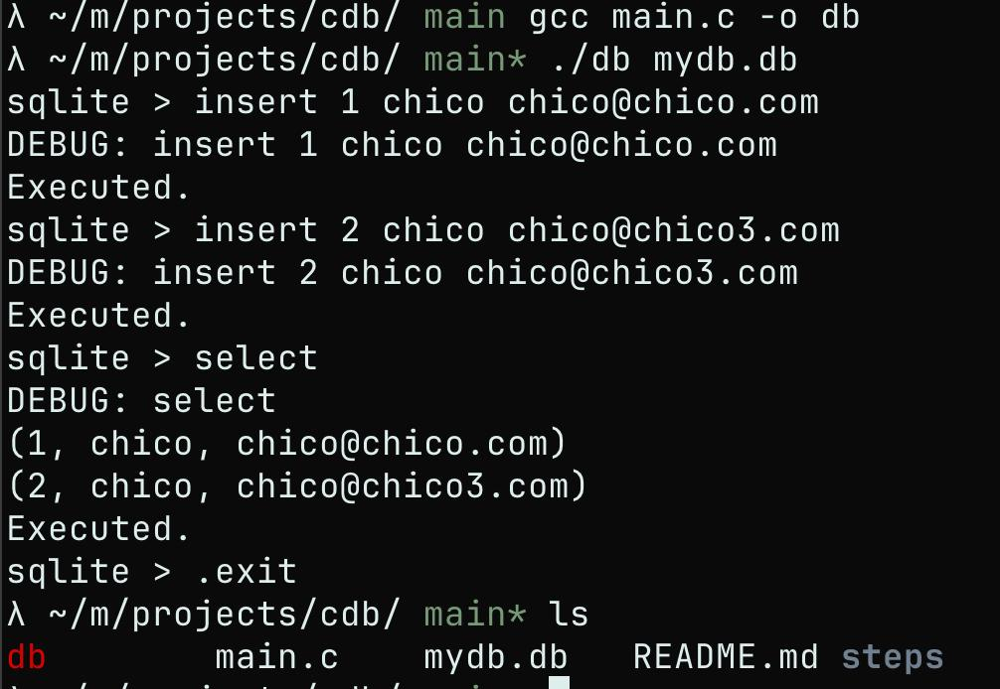
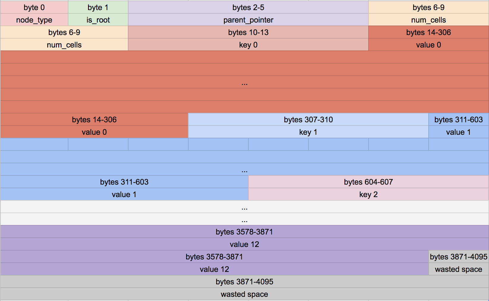

# Worst SQLite database clone.

What format is data save? 
When does it move from memory to disk?
Why can there only be one primary key per table?
How does rolling back a transaction work?
How are indexes formatted?
When and how does a full table scan happen?
What format is a prepared statement save in?

Better "HOW DOES A DATABASE WORKKKKKKKKKS?"

Let's try to write it from scratch


## Todo
- [x] REPL
- [x] Tokenizer and Parser
- [x] Code Generator 
- [x] Virtual Machine and First Memory
- [x] Disk Storage with pages
- [x] BTree structure
- [ ] splite page
- [ ] binary search

## Run
```bash
gcc main.c -o db
./db mydb.db

sqlite > insert 1 chico chico@email.com
sqlite > select
sqlite > .exit
```



## Steps

Tokenizer -> Parser -> Code Generator -> Virtual Machine -> BTree -> Pager -> OS interface.

A query goes through a chain of components in order to retrieve or modify data.
The front-end consist of the:

Tokenizer -> parser -> code generator

The input to the frontend is a SQL query. The output is sqlite virtual machine 
bytecode (essentially a compiled program that can operate on the database).

the back-end consists:
virtual machine -> btree -> pager -> os interface

The virtual machine takes bytecode generated by the 
front-end as instructions. It can then perform operations on
one or more tables or indexes, each of which is stored in 
a data structure called a B-tree. The VM is essentially a 
big switch statement on the type of bytecode instruction.

Each B-tree consists of many nodes. Each node is one page 
in length. The B-tree can retrieve a page from disk or save 
it back to disk by issuing commands to the pager.

The pager receives commands to read or write pages of data. 
It is responsible for reading/writing at appropriate offsets 
in the database file. It also keeps a cache of recently-accessed
pages in memory, and determines when those pages need to be 
written back to disk.

The os interface is the layer that differs depending on which 
operating system sqlite was compiled for. In this tutorial, 
I’m not going to support multiple platforms.

A journey of a thousand miles begins with a single step, 
so let’s start with something a little more straightforward:
the REPL.

## Notes on In Memory Append Only, Single Table DATABASE.

limitations:
- support only inserting a new row and printing all rows
- reside only in memory( no persistent disk UNTIL now)
- support a single hadrd-coded table


column type:
id       integer
username varchar(32)
email    varchar(255)

statements are like:

insert 1 chico chico@matheusfrancsico.com.br


# Disk 

Read about the formats [format](./notes/formats.md)



